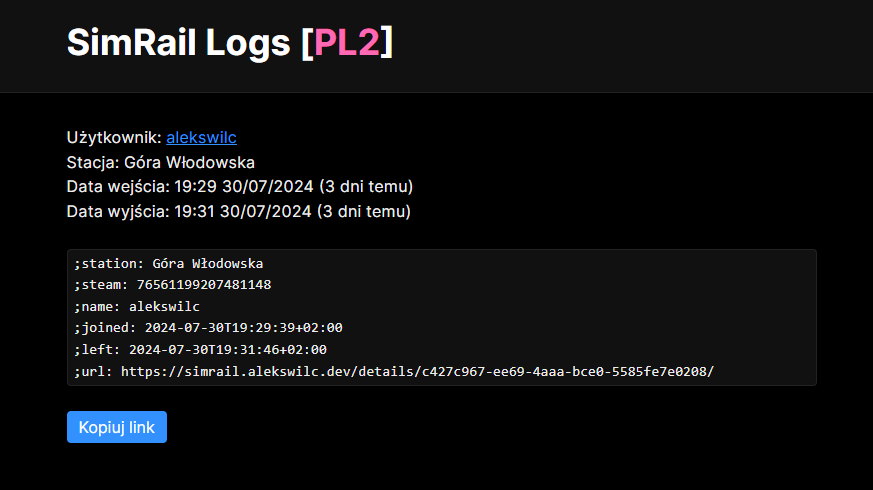
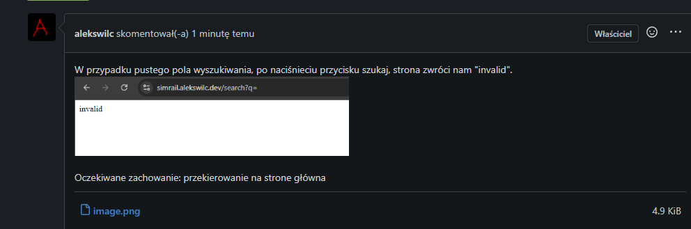

# Simrail Logs
Prosty projekt, logujący wyjścia z posterunków.

## Cele
- Ułatwienie zgłaszania graczy, którzy robią "Hit and Run" (psuje i wychodze z posterunku)

## Dalszy rozwój
- Wybieranie serwerów
- Obsługa pociagów, a nie tylko posterunków

# Jak korzystać?

- Otwórz https://simrail.alekswilc.dev/
- Znajdź interesujący Cie rekord.
- Naciśnij przycisk więcej
- Naciśnij na okienko z angielskim zapisem informacji (lub przycisk kopiuj link)
- Wklej na kanał #multiplayer-help-request z opisem sytuacji.
- Gotowe, kolejny troll jest zgłoszony.

# Zgłaszanie błedów
Aplikacja jest w wersji testowej, i obsługuje tylko serwer PL2

Jak zgłosić błąd?
- Otwórz https://git.alekswilc.dev/alekswilc/simrail-logs/issues
- Załóż konto (to tylko kilka kliknięć, a twoje zgłoszenie bardzo mi pomoże)
- Naciśnij przycisk "New issue" ("Nowe zgłoszenie")
- W tytule napisz krótki opis (np. Problem z wyświetleniem strony)
- Opisz problem (kiedy występuje, podaj linki, postaraj sie napisać jak moge odtworzyć ten błąd, jak powinna zachowywać sie aplikacja bez tego błędu)
- Poczekaj na informacje z mojej strony
- Dziekuje :)

# Zgłaszanie propozycji
- Otwórz https://git.alekswilc.dev/alekswilc/simrail-logs/issues
- Załóż konto (to tylko kilka kliknięć, a twoje zgłoszenie bardzo mi pomoże)
- Naciśnij przycisk "New issue" ("Nowe zgłoszenie")
- W tytule napisz krótki opis (np. Dodanie serwera PL3)
- Opisz propozycje (Dodanie listy serwerów, obsługa serwera PL3)
- Poczekaj na informacje z mojej strony
- Dziekuje :)

# Licencja
    Copyright (C) 2024 Aleksander <alekswilc> Wilczyński

    This program is free software: you can redistribute it and/or modify
    it under the terms of the GNU Affero General Public License as
    published by the Free Software Foundation, either version 3 of the
    License, or (at your option) any later version.

    This program is distributed in the hope that it will be useful,
    but WITHOUT ANY WARRANTY; without even the implied warranty of
    MERCHANTABILITY or FITNESS FOR A PARTICULAR PURPOSE.  See the
    GNU Affero General Public License for more details.

    You should have received a copy of the GNU Affero General Public License
    along with this program.  If not, see <https://www.gnu.org/licenses/>.

Made with ❤️ by [alekswilc](https://www.alekswilc.dev/) for SimRail Community